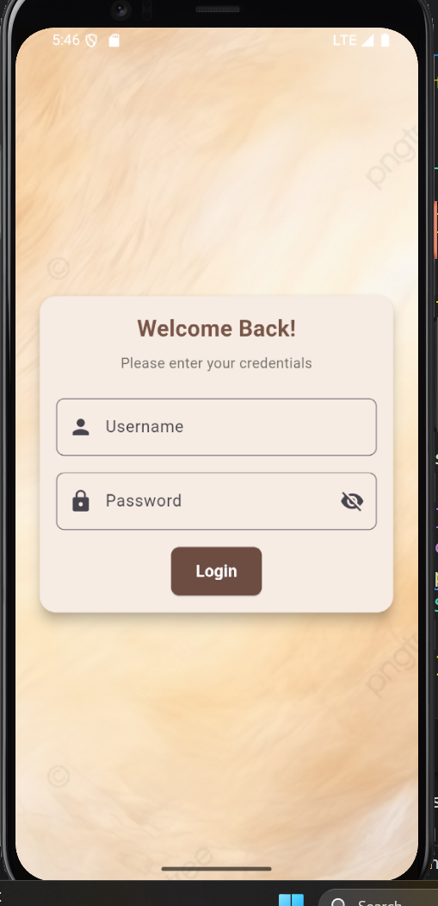
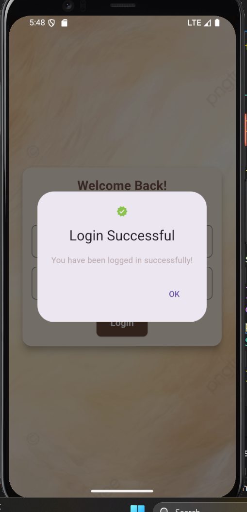
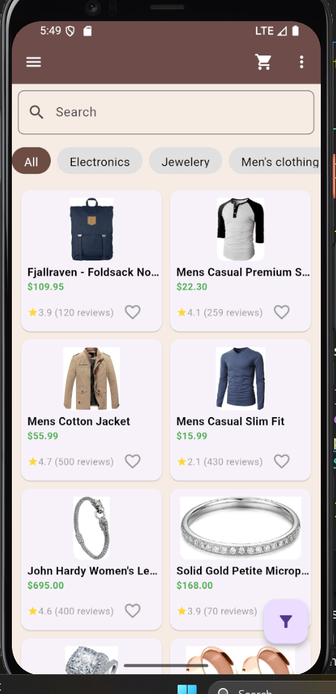
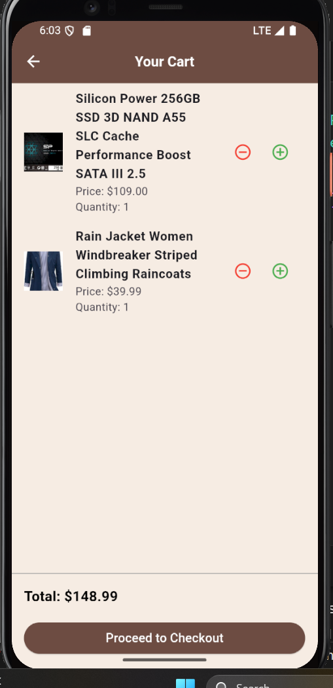
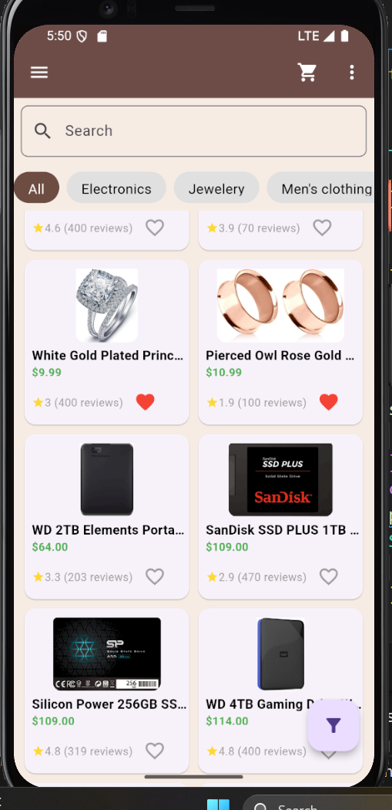
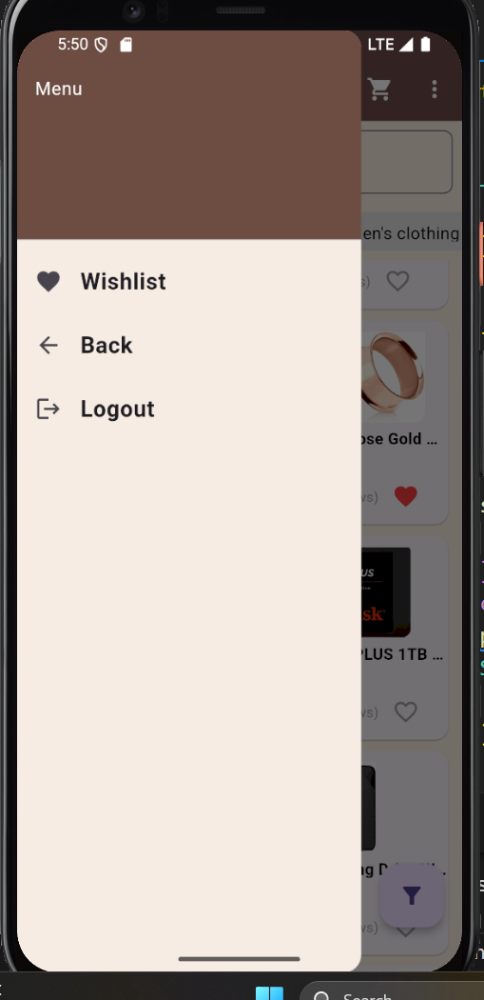
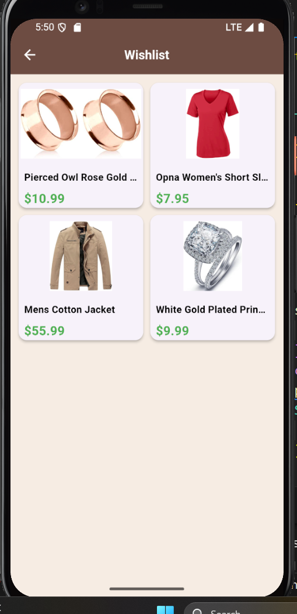
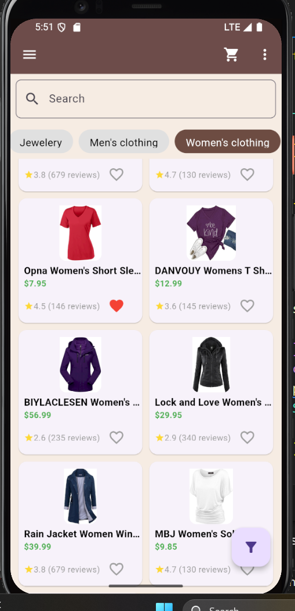
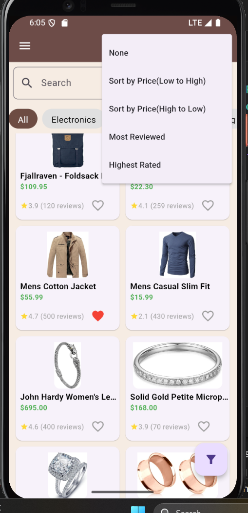
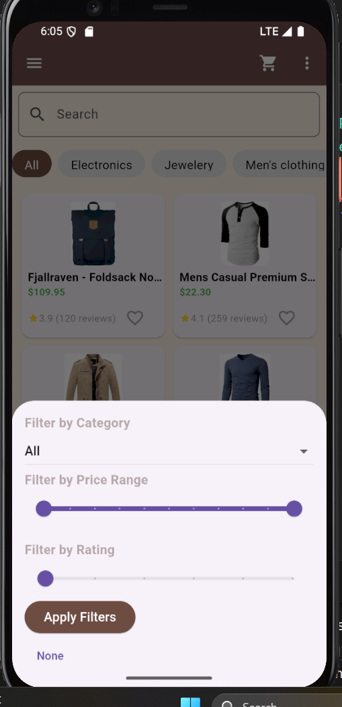

# E-commerce Flutter App

## Overview

This E-commerce Flutter app is a responsive, feature-rich mobile and web application designed to simulate an online shopping experience. It includes functionality for browsing products, searching, filtering, sorting, managing a cart, and a wishlist, as well as user authentication.
The app is built using Flutter and integrates the FakeStore API for fetching product and authentication data. It adheres to clean architecture principles by separating UI and business logic wherever applicable. Persistent storage is implemented for cart and wishlist data using shared_preferences.

## Features

### User Authentication
    •	Login functionality with error handling.
    •	Token-based authentication using the FakeStore API.
    •	Login credentials are validated, and tokens are securely stored using             shared_preferences.
    •	Logout functionality clears tokens and redirects the user to the login screen.

### Product Listings
    •	Infinite scrolling for products (initially loads 10 products, fetches more on scrolling).
    •	Featured products displayed with details like image, price, and ratings.
### Product Detail Page
    •	Detailed view of the product with description, price, ratings, and reviews.
    •	Simulated product reviews generated dynamically.
### Search, Filter, and Sort
    •	Search products by name.
    •	Filter products by category, price range, and rating.
    •	Sort products by price (low-to-high, high-to-low), popularity (most reviewed), and ratings.
### Cart Functionality
    •	Add products to the cart and update quantities.
    •	Persistent cart data using shared_preferences.
    •	Display cart summary with total price.
    •	Checkout functionality with a form to input user details.
### Wishlist Functionality
    •	Add/remove products to/from the wishlist.
    •	Persistent wishlist data using shared_preferences.
    •	Wishlist items displayed in a grid view.
### Responsive Design
    •	Optimized for different screen sizes (mobile, tablet, desktop).
    •	Uses adaptive grid layouts and other responsive UI elements.
### Clean Architecture
    •	Separation of UI and business logic into different folders.
    •	Use of ChangeNotifier for state management (Provider package).
### Theming
    •	Custom color palette: 
    o	Black: #000000
    o	Beige: #F6ECE3
    o	White: #FFFFFF
    o	Brown: #91766E

## Folder Structure

ecomm_app/
│
├── lib/
│   ├── components/
│   │   ├── cart_item.dart
│   │   ├── product_card.dart
│   │
│   ├── pages/
│   │   ├── login_page.dart
│   │   ├── homepage.dart
│   │   ├── product_detail_page.dart
│   │   ├── cart_page.dart
│   │   ├── wishlist_page.dart
│   │   ├── checkout_page.dart
│   │
│   ├── providers/
│   │   ├── cart_provider.dart
│   │   ├── wishlist_provider.dart
│   │
│   ├── utils/
│   │   ├── api_service.dart
│   │
│   └── main.dart
│
├── assets/
│   └── images/
│       ├── background.png
│       └── ...
│
└── pubspec.yaml

## Dependencies

Add the following dependencies to your pubspec.yaml file:
dependencies:
  flutter:
    sdk: flutter
  provider: ^6.0.5
  shared_preferences: ^2.1.0
  http: ^0.15.0

## Setup Instructions

1. Clone the Repository
    'git clone <repository-url>'
    'cd ecomm_app'
2. Install Dependencies
    Run the following command to install required Flutter dependencies:
        'flutter pub get'
3. Add API Key
    If the FakeStore API requires an API key, add it in api_service.dart.
4. Run the App
    To run the app on your desired device or emulator:
        'flutter run'

## Key Code Highlights

### Persistent Cart and Wishlist
    Implemented using shared_preferences for saving and retrieving data:
    •	Cart: cart_provider.dart
    •	Wishlist: wishlist_provider.dart

### Responsive Design
    Used MediaQuery to detect screen width and adjust UI:
    final screenWidth = MediaQuery.of(context).size.width;
    final isTablet = screenWidth > 600 && screenWidth <= 1024;
    final isDesktop = screenWidth > 1024;

### API Integration
    Fetching products and authenticating users via the FakeStore API:
    •	Fetch Products: ApiService.fetchAllProducts()
    •	Login User: ApiService.loginUser(email, password)

### Clean Architecture
    •	UI Layer: Files in /pages and /components folders.
    •	Business Logic Layer: Files in /providers and /utils folders.

## Screenshots

### Login Page

### Login Successful Image

### Home Page

### Product Detail Page

### Cart Page

### Wishlisted Products 

### Drawer Page

### Wishlist Page

### Searching Page

### Categories 

### Sorting Products 

### Filtering Products

## Future Improvements
    •	Add animations for smoother UI transitions.
    •	Improve accessibility by supporting multiple languages.
    •	Add test cases for components and providers.
